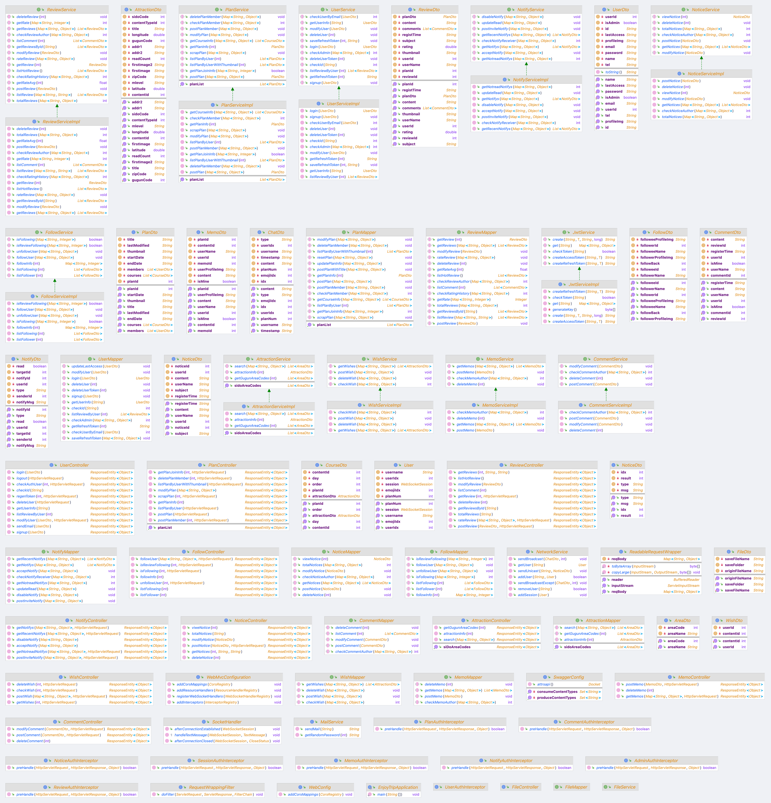

# :airplane_small: EnjoyTrip

**여행 계획(플랜)을 생성하고, 친구들과 공유해 함께 편집할 수 있는 웹 서비스**

---

# :computer: 팀원 소개

- 최용혁
  - **API 작성** - Attraction, Memo, Notice, Notify
  - **Swagger**를 이용한 API 문서화 작업 - Request, Response 설정 및 Test Value 설정
- 황서영
  - Springboot 초기 세팅 및 Controller, Service, Mapper, DTO 클래스 설계
  - **API 작성** - Plan, Review, Users, Follow, Wish, Comment, Notify
  - **Interceptor**를 통한 Session 및 각 API에 대한 **권한 인증 처리**

---

# :seedling: 기술 스택

- SpringBoot + Maven
- MyBatis
- MySQL
- Swagger
- Git

---

# :chart_with_upwards_trend: ERD

---

# :chart_with_upwards_trend: 클래스 다이어그램

---

# :bookmark: 주요 컨트롤러

| 컨트롤러 이름   | 경로      | 설명                                      |
| --------------- | --------- | ----------------------------------------- |
| 유저 컨트롤러   | /users    | 회원 정보 관리 및 로그인 처리             |
| 관광지 컨트롤러 | /attrs    | 관광지 정보 및 검색 처리                  |
| 플랜 컨트롤러   | /plans    | 여행 계획 관리                            |
| 메모 컨트롤러   | /memos    | 여행 계획 속 단일 경유지에 대한 메모 처리 |
| 리뷰 컨트롤러   | /reviews  | 리뷰 게시글 처리                          |
| 댓글 컨트롤러   | /comments | 리뷰에 대한 댓글 처리                     |
| 공지 컨트롤러   | /notices  | 공지 게시글 처리                          |
| 알림 컨트롤러   | /notifys  | 개별 사용자에 대한 알림 처리              |
| 팔로우 컨트롤러 | /follows  | 팔로우 관계 처리                          |
| 찜 컨트롤러     | /wishes   | 개별 사용자가 찜한 관광지에 대한 처리     |

---

# :page_facing_up: 전체 API 리스트

| 설명                    | 메소드                                                       | 인터셉터                                                                                                                                                                   | URL                               |
| ----------------------- | ------------------------------------------------------------ | -------------------------------------------------------------------------------------------------------------------------------------------------------------------------- | --------------------------------- |
| 시도 리스트             |            |                                                                                                                    | /attrs/areacodes                  |
| 군구 리스트             |            |                                                                                                                    | /attrs/areacodes/{sido}           |
| 관광지 검색             |            |                                                                                                                    | /attrs/search?<i>querystring…</i> |
| 관광지 정보             |            |                                                                                                                    | /attrs/{contentid}                |
| 메모 등록               |            |                                                               | /memos                            |
| 메모 리스트             |            |                                                               | /memos/{planid}/{courseid}        |
| 메모 삭제               |  |                                                               | /memos/{memoid}                   |
| 공지 등록               |            |                                                         | /notices                          |
| 공지 수정               |          |                                                               | /notices                          |
| 공지 리스트             |            |                                                                                                                                                                            | /notices?page={page}              |
| 공지 게시글             |            |                                                                                                                                                                            | /notices/{noticeid}               |
| 공지 삭제               |  |    | /notices/{noticeid}               |
| 초대 알림 전송          |            |                                                               | /notifys/invite                   |
| 알림 정보               |            |                                                                                                                    | /notifys?page={page}              |
| 알림 내 버튼 삭제       |          |                                                               | /notifys                          |
| 썸네일 있는 플랜 리스트 |            |                                                                                                                    | /plans/thumbnails                 |
| 플랜 리스트             |            |                                                                                                                    | /plans                            |
| 플랜 정보               |            |                                                               | /plans/{planid}                   |
| 새 플랜 등록            |            |                                                                                                                    | /plans                            |
| 플랜 수정               |          |                                                               | /plans                            |
| 플랜 탈퇴               |  |                                                               | /plans/{planid}/users             |
| 플랜 가입               |            |                                                                                                                    | /plans/{planid}/users             |
| 플랜 스크랩             |            |                                                                                                                    | /plans/{planid}                   |
| 리뷰 작성               |            |                                                                                                                    | /reviews                          |
| 리뷰 리스트             |            |                                                                                                                                                                            | /reviews?page={page}&sort={sort}  |
| 리뷰 게시글             |            |                                                                                                                                                                            | /reviews/{reviewid}               |
| 인기 리뷰 리스트        |            |                                                                                                                                                                            | /reviews/hot                      |
| 리뷰 댓글 리스트        |            |                                                                                                                                                                            | /reviews/{reviewid}/comments      |
| 사용자 리뷰 리스트      |            |                                                                                                                    | /users/{userid}/reviews           |
| 리뷰 수정               |          |                                                             | /reviews                          |
| 리뷰 삭제               |  |                                                             | /reviews/{reviewid}               |
| 리뷰 평점               |            |                                                             | /reviews/rating                   |
| 유저 로그인             |            |                                                                                                                                                                            | /users/login                      |
| 유저 로그아웃           |            |                                                                                                                    | /users/logout                     |
| 유저 등록               |            |                                                                                                                                                                            | /users                            |
| 유저 탈퇴               |  |                                                                                                                    | /users                            |
| 유저 정보               |            |                                                                                                                    | /users/{userid}                   |
| 유저 정보 수정          |          |                                                                                                                    | /users                            |
| 유저 비밀번호 초기화    |            |                                                                                                                                                                            | /users/email                      |
| 유저 팔로우             |            |                                                                                                                    | /follow                           |
| 유저 언팔로우           |  |                                                                                                                    | /follow/{followingid}             |
| 팔로잉 리스트           |            |                                                                                                                    | /follow/followees/{followerid}    |
| 팔로워 리스트           |            |                                                                                                                    | /follow/followers/{followeeid}    |
| 관광지 찜               |            |                                                                                                                    | /wishes                           |
| 관광지 찜 취소          |  |                                                                                                                    | /wishes/{contentid}               |
| 찜한 관광지 리스트      |            |                                                                                                                    | /wishes?page={page}               |
| 리뷰 댓글 작성          |            |                                                                                                                    | /comments                         |
| 리뷰 댓글 수정          |          |                                                            | /comments                         |
| 리뷰 댓글 삭제          |  |                                                            | /comments/{commentid}             |

---

# :page_facing_up: 컨트롤러 별 API 리스트

Request 및 Response **상세 정보**는 <a href="http://localhost/swagger-ui/index.html"><b>Swagger API Docs</b></a>에서 확인 가능

## :family: 유저 컨트롤러

---

## :map: 관광지 컨트롤러

---

## :airplane_small: 플랜 컨트롤러

---

## :notepad_spiral: 메모 컨트롤러

---

## :pencil: 리뷰 컨트롤러

---

## :speech_balloon: 댓글 컨트롤러

---

## :mega: 공지 컨트롤러

---

## :bell: 알림 컨트롤러

---

## :busts_in_silhouette: 팔로우 컨트롤러

---

## :pushpin: 찜 컨트롤러

---
